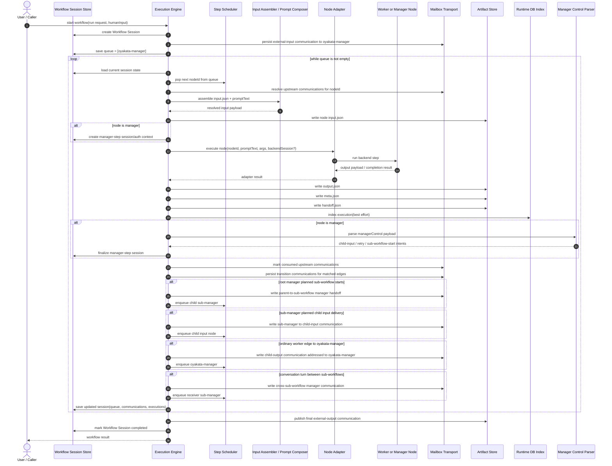

# oyakata

`oyakata` is a TypeScript project that manages writing sessions through cooperative multi-agent orchestration.

## Purpose

The system coordinates multiple agent execution backends and controls their collaboration with a JSON workflow definition.

Primary agent backends:
- `codex-agent`
- `claude-code-agent`

## Core Concept: Workflow (JSON)

A workflow is the execution contract for session management. It must represent:
- composition of multiple nodes
- branch conditions and branch-judge nodes
- loop conditions and loop-judge nodes
- branch bodies and loop bodies modeled as sub-workflow scopes when they span multiple nodes
- per-node completion conditions
- graph connectivity between nodes
- execution timeout policy (global default and per-node override)
- optional workflow-level prompt policy for `oyakata` and worker prompt composition

Runtime execution inputs for each executable node are separated into node files:
- `executionBackend`
- `model`
- `promptTemplate`
- optional `promptTemplateFile` for workflow-local `.md`/text prompt sources
- `variables`
- optional `output` contract:
  - `description`: human guidance for the expected business payload
  - `jsonSchema`: optional JSON Schema subset enforced by the runtime against the candidate payload
  - `maxValidationAttempts`: optional retry budget for malformed/schema-invalid candidate output
  - publication model: the LLM/backend proposes only the business JSON object; the runtime validates it, writes final `output.json`, and publishes mailbox output only after acceptance

## Workflow Directory Layout

Workflows are created under `.oyakata/` in subdirectories.

Example:

```text
.oyakata/
  writing-session/
    workflow.json
    workflow-vis.json
    node-draft.json
    node-review.json
```

Required files:
- `workflow.json`: workflow structure and metadata (must include `description` for workflow purpose; may include `prompts.oyakataPromptTemplate` and `prompts.workerSystemPromptTemplate`)
- `workflow-vis.json`: browser visualization state for vertical flow rendering (node `order`; `indent/color` are derived from graph semantics)
- `node-{id}.json`: executable node payload (`executionBackend`, `model`, `promptTemplate`, `variables`, optional `output` contract)
- prompt authoring recommendation: keep `workflow.json` / `node-{id}.json` in JSON, but store long prompt bodies in workflow-local files such as `prompts/<node-id>.md` and reference them with `promptTemplateFile`

Runtime boundary rule:
- root `oyakata` input and final workflow output are also exposed through mailbox artifacts, so external-to-root handoff uses the same mailbox model as parent/sub-workflow nesting

## Runtime Components

The runtime model is easier to follow if component names are separated by scope:

- `Workflow Session`: one end-to-end workflow run; persists queue, communications, node executions, and runtime variables
- `Execution Engine`: the main runtime loop that pops a node from the queue, executes it, persists artifacts, and plans follow-up work
- `Step Scheduler`: the part of the engine that appends next node ids back into the session queue
- `Mailbox Transport`: durable node-to-node communication artifacts materialized by the runtime
- `Artifact Store`: runtime-owned `input.json`, `output.json`, `meta.json`, and `handoff.json` files for each node execution
- `Runtime DB Index`: SQLite index used for queryable execution summaries and logs; file artifacts remain source of truth
- `Node Adapter`: backend bridge such as `codex-agent` or `claude-code-agent`
- `Manager Control Parser`: parser for manager-authored `managerControl` payloads after a manager step finishes

Node roles and names:

- `oyakata-manager`: the root manager node of the workflow; owns root-scope orchestration and cross-boundary manager handoff
- `sub-manager`: the manager node inside a sub-workflow; owns child-node delivery within that sub-workflow
- `input`: the boundary input node of a sub-workflow
- `output`: the boundary output node of a sub-workflow or root workflow
- `worker node`: any non-manager executable node that performs task/input/output/judge work

Session terms:

- `Workflow Session` is the long-lived orchestration state for the full run
- `Manager Session` is the short-lived control-plane/auth scope for one manager step
- `Oyakata Step` means one execution of `oyakata-manager` or a `sub-manager`
- `Worker Step` means one execution of a non-manager node

Execution rule:

- `oyakata-manager` does not remain blocked inside one long-lived step waiting for child output
- instead, a child step finishes, the runtime accepts and publishes its output, writes mailbox communication addressed to the owning manager, and enqueues the next manager step
- backend session reuse is optional and node-local; orchestration progression still happens as discrete runtime steps

## Workflow Step Sequence

The sequence below shows the current runtime behavior when `oyakata` starts a workflow and nodes execute step-by-step.



## Deterministic Mock Workflow Example

This repository now includes a ready-to-run deterministic example:

- `.oyakata/software-auto-pipeline/workflow.json`
- `.oyakata/software-auto-pipeline/workflow-vis.json`
- `.oyakata/software-auto-pipeline/node-*.json`
- `.oyakata/software-auto-pipeline/mock-scenario.json`

The workflow covers:
- design
- design discussion
- implementation
- security check
- code review
- test
- test review

`mock-scenario.json` pins deterministic per-node outputs for the CLI execution backends.
The sample `test-review` node returns `needs_rework` on first execution and `approved` on second execution to demonstrate looped rework.

Run example:

```bash
bun run src/main.ts workflow run software-auto-pipeline \
  --workflow-root ./.oyakata \
  --mock-scenario ./.oyakata/software-auto-pipeline/mock-scenario.json \
  --output json
```

Progress / resume / rerun commands:

```bash
# Pause after a few steps
bun run src/main.ts workflow run software-auto-pipeline --workflow-root ./.oyakata --max-steps 3 --output json

# Inspect progress
bun run src/main.ts session progress <session-id> --output json

# Resume paused session
bun run src/main.ts session resume <session-id>

# Re-run from a specific node (creates a new session)
bun run src/main.ts session rerun <session-id> implement --output json
```

## Git Policy

Default policy for version control:
- Track workflow definitions in Git:
  - `.oyakata/<workflow-name>/workflow.json`
  - `.oyakata/<workflow-name>/workflow-vis.json`
  - `.oyakata/<workflow-name>/node-*.json`
- Do not track runtime execution outputs in Git:
  - `{artifact-root}/{workflow_id}/executions/{workflowExecutionId}/nodes/{node}/{node-exec-id}/input.json`
  - `{artifact-root}/{workflow_id}/executions/{workflowExecutionId}/nodes/{node}/{node-exec-id}/output.json`
  - `{artifact-root}/{workflow_id}/executions/{workflowExecutionId}/nodes/{node}/{node-exec-id}/meta.json`
  - dynamic session/progress files under `.oyakata-datas/`

Default runtime paths:
- persistent artifact root: `.oyakata-datas/workflow/`
- dynamic operational state root: `.oyakata-datas/` (for example session store files)
- runtime SQLite index: `.oyakata-datas/oyakata.db`

The repository `.gitignore` enforces this for `.oyakata-datas/`.
If you use a custom `--artifact-root` or `OYAKATA_ARTIFACT_ROOT`, add that path to your local/project ignore rules.

Runtime SQLite behavior:
- File artifacts remain source-of-truth for full node payload files.
- SQLite stores queryable runtime index data for:
  - session snapshots
  - node input/output hashes and payload JSON
  - node execution logs

## Interfaces

- TUI: `oyakata tui [workflow-name] [--workflow <name>] [--resume-session <session-id>]`
  - Interactive terminal: select workflow (if omitted), input prompt, execute, and watch per-node progress.
  - Non-interactive terminal: promptless fallback mode is used; `workflow-name` is required.
  - Resume: `--resume-session` resumes an existing session directly.
- Web UI: `oyakata serve`, then open `http://127.0.0.1:43173/`
  - Choose workflow, input prompt, start async execution, and watch session/node progress by polling session state.
- GraphQL control plane: `oyakata gql "<graphql-document>"`
  - Sends GraphQL requests to `http://127.0.0.1:43173/graphql` by default.
  - Uses `--variables '{"key":"value"}'` or `--variables @vars.json` for GraphQL variables.
  - Uses `OYAKATA_MANAGER_AUTH_TOKEN` automatically for bearer auth unless `--auth-token` or `--auth-token-env` overrides it.
  - For manager-scoped calls, forwards `OYAKATA_MANAGER_SESSION_ID` to `/graphql` so manager mutations can omit `managerSessionId` from the GraphQL input.
  - The HTTP server does not inherit manager auth or scope from its own ambient `OYAKATA_MANAGER_*` environment; manager-scoped HTTP calls must supply transport metadata explicitly.
  - The HTTP server also does not trust in-process auth/session fallback fields for `/graphql`; only the request `Authorization` header and `X-Oyakata-Manager-Session-Id` header can establish manager scope there.

Example:

```bash
bun run src/main.ts gql \
  'query ($workflowName: String!) { workflow(workflowName: $workflowName) { workflowId managerNodeId } }' \
  --variables '{"workflowName":"software-auto-pipeline"}' \
  --output json
```

Workflow execution overview by run ID:

```bash
bun run src/main.ts gql \
  'query ($workflowExecutionId: String!) { workflowExecutionOverview(workflowExecutionId: $workflowExecutionId, firstCommunications: 50, recentLogLimit: 10) { workflowExecutionId workflowId workflowName status nodes { nodeId nodeExecId backendSessionId backendSessionMode output } communications { totalCount items { record { communicationId fromNodeId toNodeId status } artifactSnapshot { outboxOutputRaw inboxMessageJson } } } } }' \
  --variables '{"workflowExecutionId":"sess-20260315T000000Z-example"}' \
  --output json
```

Frontend verification:
- The browser frontend lives under `ui/` and is verified separately from the root TypeScript program.
- The current checked-in frontend is SolidJS.
- `bun run ui:framework` reports the active checked-in frontend entrypoint and any local workspace blockers for the verified UI toolchain.
- `bun run typecheck:ui` detects the active frontend entrypoint and runs the matching framework-aware verification path.
- `bun run test:ui` runs UI unit tests non-interactively through Vitest and does not rely on the interactive Vitest UI server.
- `bun run test:ui:interactive` is the opt-in interactive Vitest UI path and uses the same repository-local Node/package guards as the other UI tooling commands.
- Run `bun run check:ui` for the UI typecheck plus bundle verification.
- Run `bun run typecheck` to verify both server and UI projects together.
- `bun run build:ui` now emits `ui/dist/frontend-mode.json` so `/api/ui-config` reports the frontend contract of the actually served assets instead of inferring it only from source entrypoints.
- Repository UI tooling commands resolve the package root from their checked-in script location rather than the caller's current working directory, so framework detection, `package.json`, and `node_modules` stay aligned.

## Library API

`oyakata` can be called as a library from external applications.

Primary exports from `src/lib.ts`:
- `inspectWorkflow(workflowName, options)`
- `executeWorkflow({ workflowName, ...options })`
- `resumeWorkflow({ sessionId, ...options })` (`sessionId` is the current public API name for workflow-run scope; design docs call this `workflowExecutionId`)
- `rerunWorkflow({ sourceSessionId, fromNodeId, ...options })` (`sourceSessionId` is the current public API compatibility name for prior `workflowExecutionId`)
- `getSession(sessionId, options)` (`sessionId` compatibility alias for `workflowExecutionId`)
- `listSessions(options)` (runtime SQLite-backed summaries)
- `getRuntimeSessionView(sessionId, options)` (session + node executions + node logs; `sessionId` is workflow-run scope)
- low-level exports: `runWorkflow`, `runCli`, `startServe`, `handleApiRequest`, `loadWorkflowFromDisk`

Minimal example:

```ts
import { executeWorkflow, getRuntimeSessionView } from "oyakata";

const run = await executeWorkflow({
  workflowName: "software-auto-pipeline",
  workflowRoot: "./.oyakata",
  artifactRoot: "./.oyakata-datas/workflow",
  runtimeVariables: { prompt: "Implement feature X" },
});

const runtime = await getRuntimeSessionView(run.sessionId, { cwd: process.cwd() });
console.log(runtime.session.status, runtime.nodeExecutions.length, runtime.nodeLogs.length);
```

`workflow.json` represents control-flow only:
- graph connectivity between nodes
- completion criteria
- branch/loop expressions and routing
- structural block typing for canonical branch-block and loop-body sub-workflows
- workflow defaults (global loop limit and default node timeout)
- references to each `node-{id}.json`

Branch behavior:
- when multiple branch conditions match, all matched branches execute (fan-out)
- when a branch body spans multiple nodes, the canonical pattern is a `subWorkflow` with `block.type = "branch-block"` entered from a `branch-judge` edge to that sub-workflow manager

Loop behavior:
- loop-local limits may be omitted and then use workflow-level global default
- when a loop body spans multiple nodes, the canonical pattern is a `subWorkflow` with `block.type = "loop-body"` and a matching `loops[].id`; the loop `continueWhen` edge should re-enter the loop-body manager

Completion behavior:
- completion can be optional for some nodes (auto-complete / no-success-judgment nodes)

Initial defaults:
- `defaults.maxLoopIterations = 3`
- `defaults.nodeTimeoutMs = 120000`

## Design Documents

- `design-docs/specs/architecture.md`
- `design-docs/specs/command.md`
- `design-docs/specs/notes.md`
- `design-docs/specs/design-workflow-json.md`
- `design-docs/specs/design-data-model.md`
- `design-docs/specs/design-tui.md`
- `design-docs/qa.md`

## Development Environment

- Runtime: Bun
- Language: TypeScript (strict mode)
- Environment: Nix flakes + direnv
